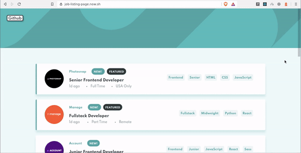
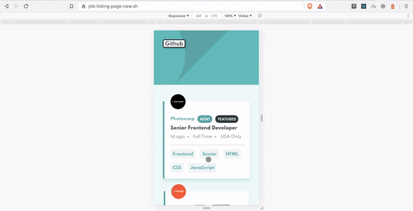

[![Issues][issues-shield]][issues-url]
[![MIT License][license-shield]][license-url]

<!-- PROJECT LOGO -->
<br />
<p align="center">
  <a href="https://job-listing-page.now.sh">
    
  </a>

  <h3 align="center">Job Listing Site (Demo)</h3>

  <p align="center">
  Interactive Site with a list of jobs which can be easily filtered
    <br />
If you like it ❤ give a star ⭐ 
  <br/>
    <br />
     :link: <a href="https://job-listing-page.now.sh">  Live Demo</a>
    &#8226; 
   :bug: <a href="https://github.com/othneildrew/Best-README-Template/issues">Report Bug</a>
    &#8226; 
    :sparkles:<a href="https://github.com/othneildrew/Best-README-Template/issues">Request Feature</a>
  </p>
</p>

<!-- TABLE OF CONTENTS -->

## Table of Contents

- [About the Project](#about-the-project)
  - [Built With](#built-with)
- [Getting Started](#getting-started)
  - [Prerequisites](#prerequisites)
  - [Installation](#installation)
- [Usage](#usage)
- [Contributing](#contributing)
- [License](#license)
- [Authors](#authors)
- [Acknowledgements](#acknowledgements)

<!-- ABOUT THE PROJECT -->

## About The Project

This is my Solution for Frontend Mentors' Challenge.

<p align="center">

  
<br >
<br/>


</p>

### Built With

- [React](https://reactjs.com)
- [SCSS](https://sass-lang.com)
- [React-Beautiful-Dnd](https://github.com/atlassian/react-beautiful-dnd)
- [Node-sass](https://github.com/sass/node-sass)

<!-- GETTING STARTED -->

## Getting Started

To get a local copy up and running follow these simple example steps.

### Prerequisites

- Node ([Download here!](https://nodejs.org/en/download))

### Installation

**1.** Fork [this](https://github.com/aman-atg/react-product-card) repository :fork_and_knife:

**2.** Clone your forked repository to your local system :busts_in_silhouette:

```sh
git clone https://github.com/<your-username>/react-product-card.git
```

Or Download and extract the zip file.

### Running

**1.** Install NPM packages

```sh
npm install
```

**2.** Run! :running_man:

```sh
npm start
```

<!-- USAGE EXAMPLES -->

## Usage

- Explore this Project to see how easily you can implement **_Drag and Drop_** Feature with [React-Beautiful-Dnd](https://github.com/atlassian/react-beautiful-dnd) for your next project.
- Handle Stylesheets using **_ITCSS Architecture_**.

<!-- CONTRIBUTING -->

## Contributing

Any contributions you make are **greatly appreciated**.

1. Create your Branch (`git checkout -b master/test-branch`)
2. Commit your Changes (`git commit -m 'Add some code'`)
3. Push to the Branch (`git push origin master/test-branch`)
4. Open a Pull Request

<!-- LICENSE -->

## License

Distributed under the MIT License. See `LICENSE` for more information.

<!-- CONTACT -->

## Authors

- [Aman Ansari](https://github.com/aman-atg)

<!-- ACKNOWLEDGEMENTS -->

## Acknowledgements

- [UXwing](https://uxwing.com)
- [Frontend Mentors](http://frontendmentor.io)
- [Challenge Link](https://www.frontendmentor.io/challenges/job-listings-with-filtering-ivstIPCt)

<!-- MARKDOWN LINKS & IMAGES -->

[issues-shield]: https://img.shields.io/github/issues/othneildrew/Best-README-Template.svg?style=flat-square
[issues-url]: https://github.com/aman-atg/Job-Listing-Site/issues
[license-shield]: https://img.shields.io/github/license/othneildrew/Best-README-Template.svg?style=flat-square
[license-url]: https://github.com/aman-atg/Job-Listing-Site/blob/master/LICENSE.txt
[preview-0]: Readme/github-preview-0.gif
[preview-1]: Readme/github-preview-1.gif
